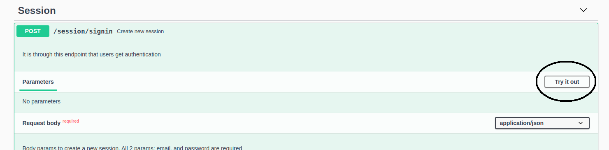
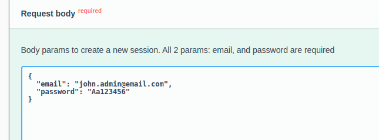
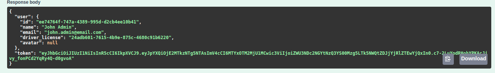
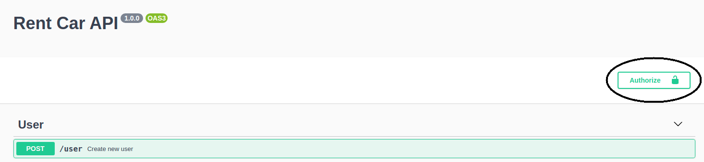
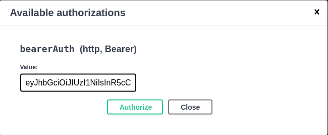

[![Contributors][contributors-shield]][contributors-url]
[![Forks][forks-shield]][forks-url]
[![Stargazers][stars-shield]][stars-url]
[![Issues][issues-shield]][issues-url]

<!-- PROJECT LOGO -->

<br />
<p align="center">

  

  <h3 align="center">Gobarber Backend</h3>

  <p align="center">
   The server-side application for the GoBarber App.
    <br />
    <a href="https://gobarber-api-torres.herokuapp.com/documentation/">Interactive API</a>
    ·
    <a href="https://github.com/Torres-ssf/gobarber-backend/issues">Report Bug</a>
    ·
    <a href="https://github.com/Torres-ssf/gobarber-backend/issues">Request Feature</a>
  </p>
</p>

<!-- ABOUT THE PROJECT -->

### About The Project

Sever-side application for GoBarber, an application for service providers, such as barbers, to control customer schedules. Postgres was used for the database along with Redis for caching data.

The implemented features are:

- Users can create new account either as a provider (barber) or as simple user.
- Users can create a new session using their credentials.
- Users can create/update their avatar image.
- Users can create appointments with their desired provider.
- Users can request for a password reset email.
- Users can update their info.
- Providers can see their daily schedule and monthly schedule.
- The monthly availability of a provider can be fetched.
- The daily availability of a provider can be fetched.
- A list of all providers can be fetched.


### Built With

The project was built using the following languages stacks:

```sh
Back-End(server)
```

- Node
- Typescript
- Docker
- [Express](https://www.npmjs.com/package/expresshttps://www.npmjs.com/package/express)
- [TypeORM](https://www.npmjs.com/package/typeorm)
- [PostgreSQL](https://www.npmjs.com/package/pg)
- [Redis](https://www.npmjs.com/package/redis)
- [Nodemailer](https://www.npmjs.com/package/nodemailer)
- [Bcryptjs](https://www.npmjs.com/package/bcryptjs)
- [Jsonwebtoken](https://www.npmjs.com/package/jsonwebtoken)
- [Multer](https://www.npmjs.com/package/multer)
- [Handlebars.js](https://www.npmjs.com/package/handlebars)
- [Celebrate](https://www.npmjs.com/package/celebrate)
- [TSyringe](https://www.npmjs.com/package/tsyringe)
- [class-transformer](https://www.npmjs.com/package/class-transformer)
- [date-fns](https://www.npmjs.com/package/date-fns)
- [Mime](https://www.npmjs.com/package/mime)
- [ioredis](https://www.npmjs.com/package/ioredis)
- [node-rate-limiter-flexible](https://www.npmjs.com/package/rate-limiter-flexible)
- [uuid](https://www.npmjs.com/package/uuid)
- [aws-sdk](https://www.npmjs.com/package/aws-sdk)
- [Swagger UI Express](https://www.npmjs.com/package/swagger-ui-express)

```sh
Testing Frameworks
```

- [Jest](https://www.npmjs.com/package/jest)


<!-- GETTING STARTED -->

### Getting Started

This application is dockerized, if have `docker` and `docker-compose` on you system it's pretty straightforward to start using it.

To get a local copy up and running follow these simple example steps.

### Prerequisites

- Node
- NPM
- Yarn
- Docker

### Installation

1. Clone the repo

```sh
git clone https://github.com/Torres-ssf/gobarber-backend
```

2. CD into the project root directory

```sh
cd gobarber-backend/
```

3. Install npm packages

```sh
yarn
```

4. Make a copy of the `ormconfig.example.json` file and rename it to `ormconfig.json`.
<br>
5. Make a copy of the `.env.example` file and rename it to `.env`.

#### Using Docker

This application uses Docker and Docker Compose and can be quickly initiate by simply running `docker-compose up`. To make this work you will need to have Docker and Docker Compose installed on your system. Docker will setup the database container, create the app database, setup the app container, and will start the app. The steps are:

1. Run docker compose.
```
docker-compose up
```

After docker compose finishing initiate the application, you will see the log `App launched at 3333 🚀`. Before using the application, it's necessary to run the migrations first.

2. To run the migrations inside the docker container, we can simply use the following script:
```
yarn typeorm:docker migration:run
```
Now the application is ready to be used.

#### Without Docker

Setting up the application without Docker requires more steps.

1. We need to edit the properties `user`, `password`, `port`, and `database` at the `ormconfig.json`. The values that you are going to use depend on how postgreSQL is setup on your system. After setting up `user`, `password`, and `port` we need to give the name of an existent database to the `database` property.
<br>
2. To setup Redis you will need to edit 3 environment variable at the `.env` file: `REDIS_PORT`, `REDIS_HOST`, and `REDIS_PASSWORD`. Assign these values according on how redis is configured on your system.
<br>
3. Now with the database properly setup, we can run the migrations:
```
yarn typeorm migration:run
```

4. And finally, we can start the app:
```
yarn dev:server
```

If everything was done properly, a log message will appear at the terminal: `Server started on port 3333!`

### Usage

It is possible to explore all API endpoints using an interactive documentation created with Swagger UI. After the application is running you can open the browser at `http://localhost:3333/documentation` and start using it.

To be able to tests login required endpoint at the Swagger Documentation, you will need first to use a jwt token to gain authorization. The steps are the following:

1. At the documentation page, we will use the session endpoint to generate an jwt token. Click at `Try it out`

<p align="center">
  
</p>

2. Give the admin credentials and click on the execute button:

<p align="center">
  
</p>

3. Copy the generated token from the response object:

<p align="center">
  
</p>

4. Click on the `Authorize` button at the top of the page:

<p align="center">
  
</p>

5. Insert the token in the value input and then click on `Authorize`:

<p align="center">
  
</p>


6. Now all endpoints can be used within the documentation.

##### App Scripts:

```
yarn dev:server
```
Script for development stage. An output message should appear on the terminal: `Server started on port 3333!`

```
yarn typeorm
```
Used for operations related to Typeorm, like creating migrations.

```
yarn typeorm:docker
```
Run typeorm cli inside Docker container.

```
yarn build
```
Transpile Typescript code into Javascript inside the dist directory.

### Run tests

This application has tests. To run the tests we can simply run the following script.

```
yarn test
```

## Authors

👤 **Torres-ssf**

- Github: [@Torres-ssf](https://github.com/Torres-ssf)
- Twitter: [@torres_ssf](https://twitter.com/torres_ssf)
- Linkedin: [torres-ssf](https://www.linkedin.com/in/torres-ssf/)

## 🤝 Contributing

Contributions, issues and feature requests are welcome!

Feel free to check the [issues page](https://github.com/Torres-ssf/gobarber-backend/issues).

## Show your support

Give a ⭐️ if you like this project!

## 📝 License

This project is [MIT](lic.url) licensed.

<!-- MARKDOWN LINKS & IMAGES -->

[contributors-shield]: https://img.shields.io/github/contributors/Torres-ssf/gobarber-backend.svg?style=flat-square
[contributors-url]: https://github.com/Torres-ssf/gobarber-backend/graphs/contributors
[forks-shield]: https://img.shields.io/github/forks/Torres-ssf/gobarber-backend.svg?style=flat-square
[forks-url]: https://github.com/Torres-ssf/gobarber-backend/network/members
[stars-shield]: https://img.shields.io/github/stars/Torres-ssf/gobarber-backend.svg?style=flat-square
[stars-url]: https://github.com/Torres-ssf/gobarber-backend/stargazers
[issues-shield]: https://img.shields.io/github/issues/Torres-ssf/gobarber-backend.svg?style=flat-square
[issues-url]: https://github.com/Torres-ssf/gobarber-backend/issues